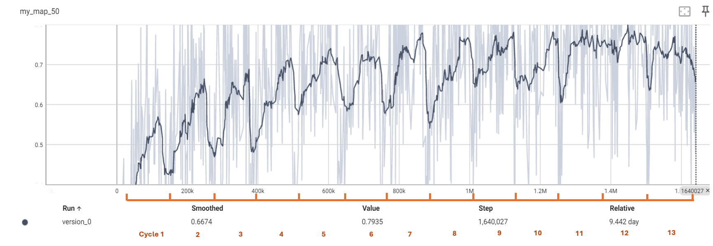
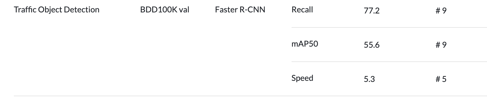
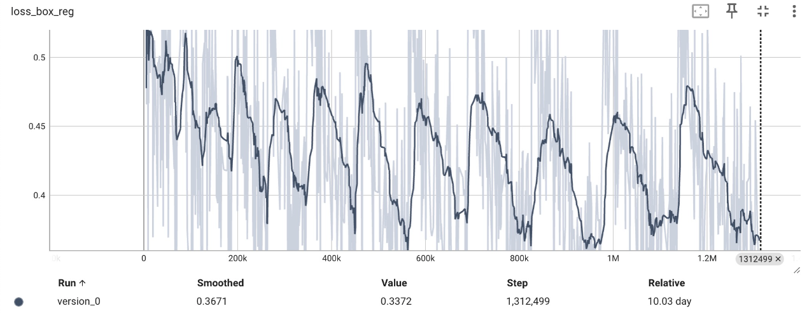
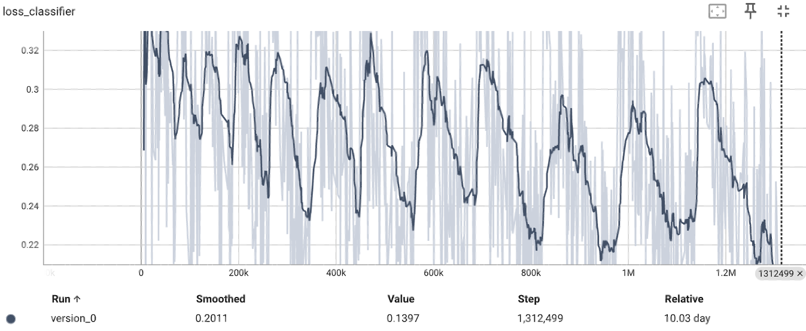
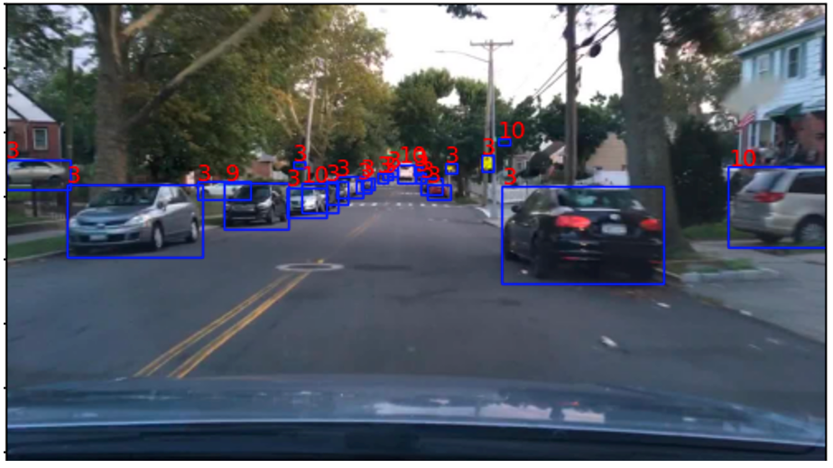
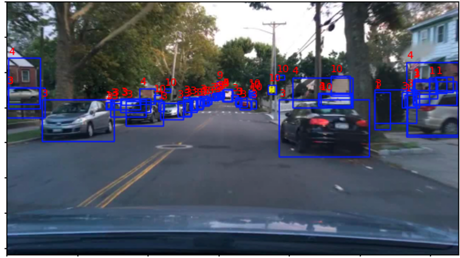

# Active Learning for Object Detection Using Top-k Sampling Strategy
Capstone Project of MSDS at Nanyang Technological University

## Motivation
A Data-driven method can be applicable for any type of ML model with quantitative per-example metrics, such as the classification score for a Convolutional Neural Network (CNN) based image classifier.
## Main Idea 
- Model: FasterRCNN (https://arxiv.org/abs/1506.01497)
- Dataset: BDD100K Images (https://doc.bdd100k.com/download.html)
- Tasks: Object Detection (Done)

Here is the main idea about active learning strategy. Since in AL (Active Learning), only labeling can be done by asking queries in the form of unlabeled instances to be labeled by an oracle (e.g., a human annotator). So we can set the same or upstreaming task model (be related to the downstreaming task model) as the pretrained model and label data from unlabeled pool and add them into the labeled pool. 


To prevent different critic standards, I set FasterRCNN as the `pretrained model` and `main task model`. First we train 70% of data and evaluate by entropy to pass the last checkpoint weight in the pretrained model. Then we use the pretrainded model to sort all training set baesd on entropy in a descending order and make 14 batches (BDD100K training set contains 7w images, using 5k as 1 batch. There are 14 batches and we train 1 batch for 50 epochs per cycle so we got 14 cycles). But actually we reset the model in the cycle training, so the main task model doesn't get any knowledge. 

From the first cyclye, we select 1k images from batch 1 randomly to unveil labels and add in labeled pool. In following $n^{th}$ cycle, we select top 1k samples from the $n^{th}$ batch. Thus, we select top $nk$ samples to reduce the label and training cost. In `Result Curve` part, you can observe the performance training stop point via the mAP50 and loss curves. 

Compared to current DL method, We save nearly 80% images and reach better mAP50 value (0.65) than Faster R-CNN benchmark(0.556). 

## Sampling Strategy
In the main task model, I created the entropy strategy to select top 1k samples from unlabeled pool.
- Entropy: the number of predicted bounding boxes in each image. New metrics to express the prediction uncertainty of samples. 


## Evaluation Metrics
The mAP is an important indicator we use to observe the degree of uncertainty and unlearnability for samples. Low mAP help to prove that samples are hard to learn.
- mAP50: Mean average precision calculated at an intersection over union (IoU) threshold of 0.50. It's a traditional evaluation metric to sample data as model's accuracy considers only the "easy" detections.


## Result Curve

### Experiment Environment:
We used 4 A100 GPUs to run the experiment about 34 hours. But the following curve is recorded on a 3080 GPU so it use about 9.5 days. 

### Result
Here I record the curves for 13 cycles training. We observed there is an uprising trend per cycle (test set), which means increased model performance. The cyclical declines in 2 loss curves prove the main task model experiences a learnable process.

The final mAP50 reached 0.65, higher than the Faster R-CNN benchmark value on the Paperwithcode https://paperswithcode.com/sota/traffic-object-detection-on-bdd100k-val. 









In BDD100K Images set, there are only 10 categories of labels. 
```
1:"person"
2:"rider
3:"car"
4:"bus"
5:"truck"
6:"bike"
7:"motor"
8:"traffic light"
9:"traffic sign"
10:"train"
```

The following picture shows the ground truth of object detection:


Using the last iterated model to predict the image in the test set:


## Installation:
```conda create -n myenv python=3.12.2 -y```

Open the folder bdd100k and clone the Github repo download dataset. Also clone the cocoapi. 
install the dependency referred to the requirements.txt

```pip install -r requirements.txt```. 

After that, we need to get to the cocoapi/PythonAPI:

```pip install -e .```

Then we will see the pycocotools listed in the conda pip list. 


When packaging `pycocotool`, there might need modify the `np.float` as `np.float64`. You can check the bugs when running `train.py` and add `val_map.pop("classes")` in line 59. 

## Run experiments

Prepare: Download the BDD100K Images dataset from the above link. Set the proper environment. 

Step 1: You can use `entropy` as indicator to evaluate model performance. 

`CUDA_VISIBLE_DEVICES=0,1,2,3 python train_part_entropy.py`

Step 2: From the above step we get the last ckpt regarding to entropy. Now we replace the ckpt path in `make_batches.py` line 25 to use the new one. Then we create the labeled pool and batches. 

`python make_batches.py`

Step 3: Unveil top 1k labels from the batch and add to the labeled pool. The labeled pool is trained for 50 epochs per cycle. 

`python main_sample.py`

Step 4: Under the directory which `tensor_logs` located, execute:

`tensorboard --logdir .`
You can get the same experiment results.  


