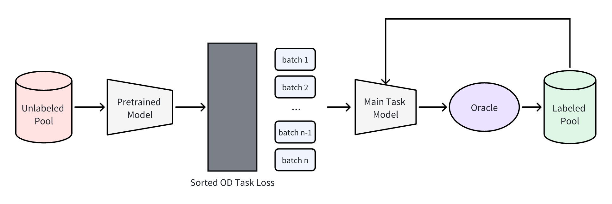

# Active Learning for Object Detection Using Top-k Sampling Strategy
Capstone Project of MSDS at Nanyang Technological University

## Motivation
A Data-driven method to investigate the to be applicable for any type of ML model with quantitative per-example metrics, such as the classification score for a Convolutional Neural Network (CNN) based image classifier.
## Main Idea
- model: FasterRCNN (https://arxiv.org/abs/1506.01497)
- Dataset: BDD 100K Images (https://doc.bdd100k.com/download.html)
- Tasks: Object Detection(Done)

Here is the main idea about active learning strategy. Since in AL (Active Learning), only labeling can be done by asking queries in the form of unlabeled instances to be labeled by an oracle (e.g., a human annotator). So we can set 1 or 2 models (upstreaming task and downstreaming task models) to sample and label data from unlabeled pool and add them into the labeled pool. 



To prevent different critic standards, I set FasterRCNN as the `pretrained model` and `main task model`. First we send 30% data

## Sampling Strategy
In the main task model, I created the entropy strategy to select top-k samples from unlabeled pool.
- mAP50
- Entropy: the number of predicted bounding boxes in each image. 


## Result Curve
After 14 cycles' training, we observed there is an uprising trend per cycle, conforming to the reality.


In BDD 100K Images set, there are only 10 categories of labels. 
```
1:"person"
2:"rider
3:"car"
4:"bus"
5:"truck"
6:"bike"
7:"motor"
8:"traffic light"
9:"traffic sign"
10:"train"
```

The following picture shows the ground truth of object detection:


Using the last iterated model to predict the image in the test set:


## Installation:
```conda create -n myenv python=3.12.2 -y```

Open the folder bdd100k and clone the Github repo download dataset. Also clone the cocoapi. 
install the dependency referred to the requirements.txt

```pip install -r requirements.txt```. 

After that, we need to get to the cocoapi/PythonAPI:

```pip install -e .```

Then we will see the pycocotools listed in the conda pip list. 


When packaging `pycocotool`, there might need modify the `np.float` as `np.float64`. You can check the bugs when running `train.py` and add `val_map.pop("classes")` in line 59. 

## Run experiments

Prepare: Download the BDD 100K Images dataset from the above link. Set the proper environment. 

Step 1: create the labeled pool and batches. 
`python make_batches.py`

Step 2: You can choose mAP50 and entropy as indicator alternatively. 
`python train_part_mAP50.py` or `python train_part_entropy.py`

Step 3: Under the directory which `tensor_logs` located, execute:
`tensorboard --log_dir= .`
You can get the same experiment results.  


